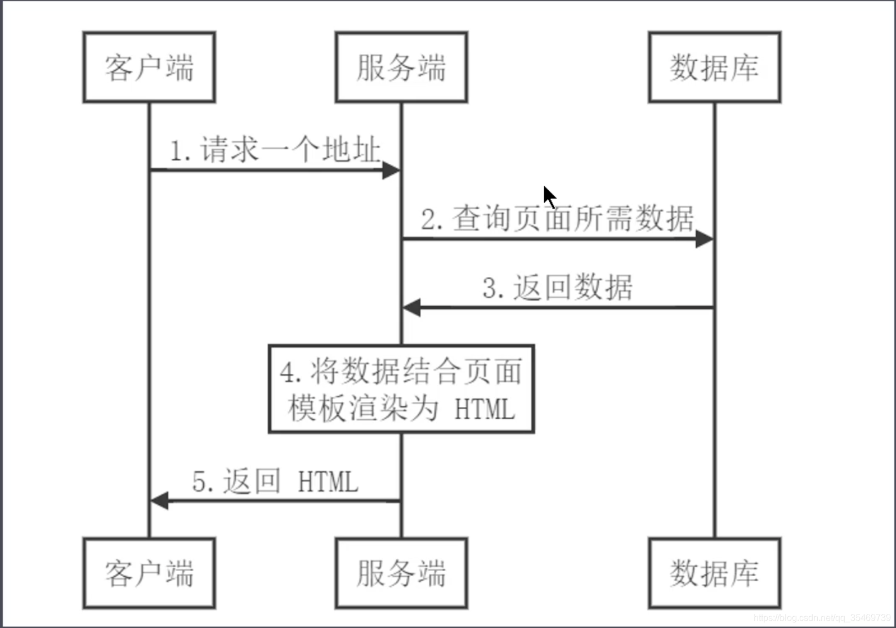
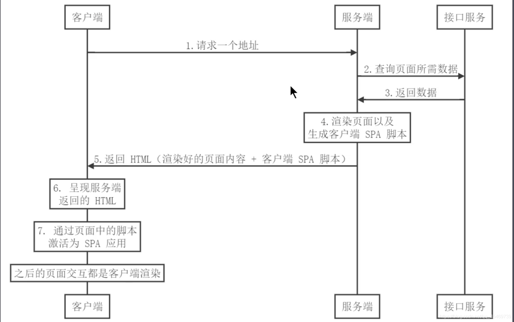
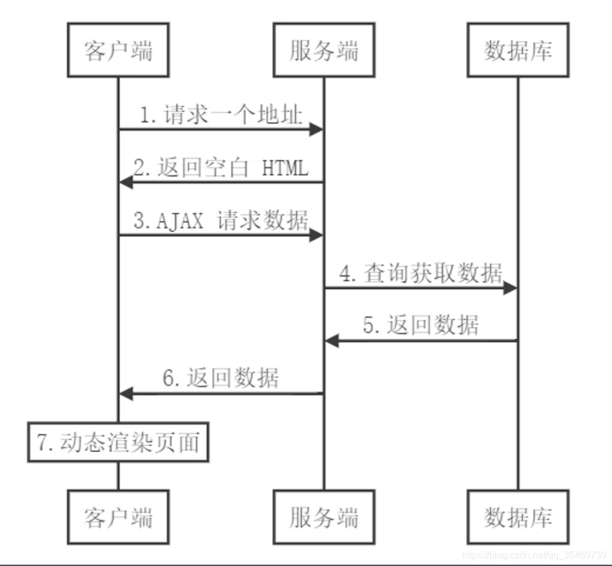
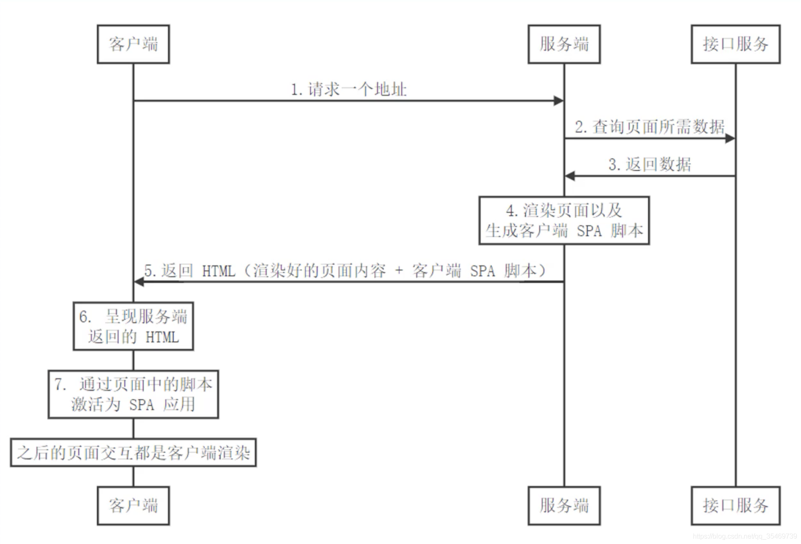

# 服务端渲染基础

## 1、概述

- SPA 单页应用

    - 优点：

        - 用户体验好

        - 开发效率高

        - 渲染性能好

        - 可维护性好

    - 缺点：

        - 首屏渲染时间长

        - 不利于 SEO

- 借鉴传统的服务器渲染



- 客户端激活为 SPA



- 同构应用

    - 通过服务端渲染首屏直出，解决SPA应用首屏渲染慢以及不利于SEO问题
    
    - 通过客户端渲染结果页面内容交互得到更好的用户体验
    
    - 这种方式通常称之为现代化的服务端渲染，也叫同构渲染
    
    - 这种方式构建的应用称之为服务端渲染应用或者是同构应用

- 相关概念

    - 什么是渲染：把数据和模板拼接在一起。渲染的本质就是字符串的解析替换。
    
    - 传统的服务端渲染：将数据结合页面模板渲染为 HTML 返回给客户端
    
    - 客户端渲染
    
    - 现代化的服务端渲染（同构渲染）

## 2、传统的服务端渲染案例

- index.js
```js
const express = require('express')
const fs = require('fs')
const template = require('art-template')

const app = express()

app.get('/', (req, res) => {
  // 1. 获取页面模板
  const templateStr = fs.readFileSync('./index.html', 'utf-8')
  console.log(templateStr)
  // 2. 获取数据
  const data = JSON.parse(fs.readFileSync('./data.json', 'utf-8'))
  console.log(data)
  // 3. 渲染：数据 + 模板 = 最终结果
  const html = template.render(templateStr, data)
  console.log(html)
  // 4. 把渲染结果发送给客户端
  res.send(html)
})

app.listen(3000, () => {
  console.log('running......')
})
```

- index.html
```html
<!DOCTYPE html>
<html lang="en">
<head>
  <meta charset="UTF-8">
  <meta name="viewport" content="width=device-width, initial-scale=1.0">
  <title>Document</title>
</head>
<body>
  <p>{{message}}</p>
</body>
</html>
```

- 缺点：

    - 前后端代码完全耦合在一起，不利于开发和维护

    - 前端没有足够发挥空间

    - 服务端压力大

    - 用户体验一般

## 3、客户端渲染CSR




- 之前服务端渲染的缺点，随着客户端Ajax技术的普及得到了有效的解决，Ajax 使得客户端动态获取数据成为可能，因此，服务端渲染的工作来到了客户端。

- 后端负责处理数据接口

- 前端负责将接口数据渲染到页面中

- 前端更为独立，不再受限于后端。

- 但客户端渲染也存在一些明显的不足：

    - 首屏渲染慢：因为客户端渲染至少发起 Http 请求三次，第一次是请求页面，第二次是请求页面里的 JS 脚本，第三次是动态数据请求。

    - 不利于 SEO：因为客户端渲染的内容都是由 JS 生成的，而搜索引擎只会请求网络路径的 html，不会去将 html 里的 JS 脚本再去请求做解析处理，因此搜索引擎获取到的首屏是空的，单页应用 SEO 几乎为0。

## 4、现代化的服务端渲染（同构渲染）

- 同构渲染 = 后端渲染 + 前端渲染

    - 基于React、Vue等框架，客户端渲染和服务端渲染的结合

        - 在客户端执行一次，用户实现服务器端渲染（首屏直出）

        - 在客户端再执行一次，用于接管页面交互

    - 核心解决SEO和首屏渲染慢的问题

    - 拥有传统服务端渲染的优点，也有客户端渲染的优点。



- 如何实现同构渲染?

    - 使用Vue、React等框架的官方解决方案

        - 优点：有助于理解原理

        - 缺点：需要搭建环境

    - 使用第三方解决方案

        - React生态的Next.js

        - Vue生态的Nuxt.js

## 5、Nuxt.js为例演示同构渲染应用

- 流程演示

    - 1、创建一个文件夹，然后进入文件夹执行yarn init生成包管理器

    - 2、然后执行yarn add nuxt安装Nuxt

    - 3、在 package.json 增加 scripts 脚本命令"dev": "nuxt"

    - 4、创建 pages 文件夹，在这个文件夹中创建 index.vue 文件和 about.vue 文件，nuxt会根据 pages 路径自动生成路由。

    - 5、index.vue 中请求数据

    ```js
    <template>
    <div id="app">
        {{message}}
    </div>
    </template>
    <script>
    import axios from 'axios'
    export default {
        name: 'Home',
        components: {},
        // Nuxt 中提供一个钩子函数`asyncData()`，专门用于获取服务端渲染的数据。
        async asyncData () {
            const { data } = await axios({
            method: 'GET',
            // 注意此处的 URL 要指定当前端口，否则默认会去服务端的 80 端口去查找。
            url: 'http://localhost:3000/data.json'
            })
            // 这里返回的数据会和 `data () {}` 中的数据合并到一起给页面使用
            return data
        }
    }
    </script>
    <style scoped></style>
    ```
    
    - 6、一次请求就拿到了完整页面，Nuxt 的服务端渲染方案解决了首屏渲染慢的问题和 SEO 的问题
    
    - 7、Nuxt 生成的是 SPA 单页应用，可以通过增加路由导航看出来，Home 和 About 两个组件切换时页面没有刷新。创建一个文件夹 layouts，然后在这个文件夹中创建一个 default.vue 文件，这个文件夹名 layouts 和 其下的 default.vue 是固定的，不能更改

    ```js
    <template>
        <div>
        <!-- 路由出口 -->
        <ul>
            <li>
                <!-- 类似于 router-link，用于单页面应用导航 -->
                <nuxt-link to="/">Home</nuxt-link>
            </li>
            <li>
                <!-- 类似于 router-link，用于单页面应用导航 -->
                <nuxt-link to="/about">About</nuxt-link>
            </li>
        </ul>
        <!-- 子页面出口 -->
        <nuxt />
        </div>
    </template>

    <script>
    export default {

    }
    </script>
    <style scoped></style>
    ```

## 6. 同构渲染的问题

- 开发条件有限

    - 浏览器特定的代码只能在某些生命周期钩子函数中使用

    - 一些外部扩展库可能需要特殊处理才能在服务端渲染应用中运行

    - 不能在服务端渲染期间操作DOM

    - 某些代码操作需要区分运行环境

- 涉及构建设置和部署的更多要求

||客户端渲染|同构渲染|
|---|---|---|
|构建|仅构建客户端应用即可|需要构建两个端|
|部署|可以部署在任意 web 服务器中|只能部署在 Node.js Server 中|

- 更多的服务器端负载

    - 在 Node 中渲染完整的应用程序，相比仅仅提供静态文件服务器，需要大量占用 CPU 资源

    - 如果应用在高流量环境下使用，需要准备相应的服务器负载

    - 需要更多的服务端渲染优化工作处理
