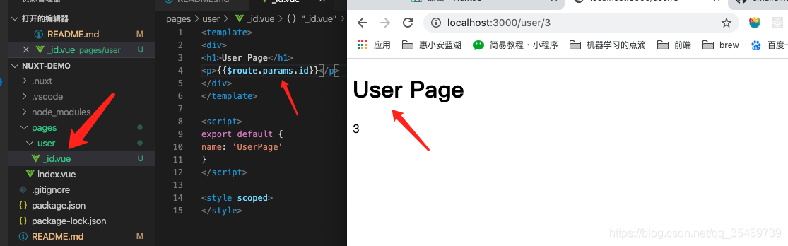

## 1、NuxtJS 介绍

- Nuxt.js 是什么

    - 一个基于 Vue.js 生态的第三方开源服务端渲染应用框架

    - 它可以帮我们轻松的使用 Vue.js 技术栈构建同构应用

    - 官网：< https://zh.nuxtjs.org >

    - Github 仓库：< https://github.com/nuxt/nuxt.js >

## 2、初始化 NuxtJS 项目

- Nuxt.js 的三种使用方式

    - 初始化项目

        - 官方文档：< https://zh.nuxtjs.org/guide/installation >

            - 方式一：使用 create-nuxt-app

            - 方式二：手动创建

                - 项目根目录运行 npm init -y,并如下添加脚本

                ```json
                {
                    "name": "my-app",
                    "scripts": {
                        "dev": "nuxt"
                    }
                }
                ```
                
                - 安装 Nuxt: npm install --save nuxt
                
                - 新建 pages 目录
                
                    - 此目录下新建我们的文件 index.vue 文件，作为首页
                
                - npm run dev 启动项目
    
    - 已有的 Node.js 服务端项目
    
        - 直接把 Nuxt 当作一个中间件集成到 Node Web Server 中
    
    - 现有的 Vue.js 项目
    
        - 非常熟悉 Nuxt.js
    
        - 至少百分之十的代码改动

## 3、路由

- 基础路由

    - 假设 pages 的目录结构如下：

    ```js
    pages/
    --| user/
    -----| index.vue
    -----| one.vue
    --| index.vue
    ```

        - 那么，Nuxt.js 自动生成的路由配置如下：

        ```js
        router: {
            routes: [
                {
                    name: 'index',
                    path: '/',
                    component: 'pages/index.vue'
                },
                {
                    name: 'user',
                    path: '/user',
                    component: 'pages/user/index.vue'
                },
                {
                    name: 'user-one',
                    path: '/user/one',
                    component: 'pages/user/one.vue'
                }
            ]
        }
        ```
    
- 路由导航

    - a 标签

        - 它会刷新整个页面，不要使用

    - nuxt-link 组件

        - https://router.vuejs.org/zh/api/#router-link-props

- 编程式导航

    - https://router.vuejs.org/zh/guide/essentials/navigation.html

    ```js
    <template>
        <div class="about-wrap">
        
        我是关于页面
        
        <br>

        <router-link to="/">点我返回首页（nuxt-link版）</router-link>
        
        <br>

        <button @click="goBack">点我返回首页（编程式导航版）</button>
        
    </div>
    </template>
    <script>
    export default {
        name: "aboutPage",
        methods: {
            goBack() {
                this.$router.push('/')
            }
        }
    }
    </script>
    <style scoped>
    </style>
    ```

- 动态路由

    - 在 Nuxt.js 里面定义带参数的动态路由，需要创建对应的以下划线作为前缀的 Vue 文件或目录。以下目录结构：

    ```js
    pages/
    --| _slug/
    -----| comments.vue
    -----| index.vue
    --| users/
    -----| _id.vue
    --| index.vue
    ```

    - Nuxt.js 生成对应的路由配置表为：

    ```js
    router: {
        routes: [
            {
            name: 'index',
            path: '/',
            component: 'pages/index.vue'
            },
            {
            name: 'users-id',
            path: '/users/:id?',
            component: 'pages/users/_id.vue'
            },
            {
            name: 'slug',
            path: '/:slug',
            component: 'pages/_slug/index.vue'
            },
            {
            name: 'slug-comments',
            path: '/:slug/comments',
            component: 'pages/_slug/comments.vue'
            }
        ]
    }
    ```

    

- 嵌套路由

    - Vue Router 嵌套路由

        - https://router.vuejs.org/zh/guide/essentials/nested-routes.html

    - Nuxt.js 嵌套路由
        
        - https://zh.nuxtjs.org/guide/routing/
        
        - 你可以通过 vue-router 的子路由创建 Nuxt.js 应用的嵌套路由。
        
        - 创建内嵌子路由，你需要添加一个 Vue 文件，同时添加一个与该文件同名的目录用来存放子视图组件。
        
        - Warning: 别忘了在父组件(.vue文件) 内增加 <nuxt-child/> 用于显示子视图内容
        
        - 假设文件结构如下：

        ```js
        pages/
        --| users/
        -----| _id.vue
        -----| index.vue
        --| users.vue
        ```

        - Nuxt.js 自动生成的路由配置如下：
        ```js
        router: {
            routes: [
                {
                path: '/users',
                component: 'pages/users.vue',
                children: [
                    {
                    path: '',
                    component: 'pages/users/index.vue',
                    name: 'users'
                    },
                    {
                    path: ':id',
                    component: 'pages/users/_id.vue',
                    name: 'users-id'
                    }
                ]
                }
            ]
        }
        ```

        

        

- 自定义路由配置

    - 参考文档：https://zh.nuxtjs.org/api/configuration-router

    - 在项目根目录下新建 nuxt.config.js，配置内容如下：

    ```js
    // Nuxt.js 配置文件
    module.exports = {
        router: {
            // 应用的根 URL。举个例子，如果整个单页面应用的所有资源可以通过 /app/ 来访问，那么 base 配置项的值需要设置为 '/app/'
            base: '/app/',
            // routes: 一个数组，路由配置表
            // resolve: 解析路由组件路径
            extendRoutes(routes, resolve) {
                routes.push({
                    name: '/hello',
                    path: 'hello',
                    component: resolve(__dirname, 'pages/about.vue') // 匹配到 /hello 时加载 about.vue 组件
                })
            }
        }
    }
    ```

## 4、视图

- 模板

    - 参考文档：https://zh.nuxtjs.org/guide/views

    

- 布局

    - nuxt.js 允许你扩展默认的布局，或在 layout 目录下创建自定义的布局

        - 默认布局

            - 可通过添加 layouts/default.vue 文件来扩展应用的默认布局

            - 提示: 别忘了在布局文件中添加 组件用于显示页面的主体内容。

            - 默认布局的源码如下：

            ```js
            <template>
                <div>
                <h1>layouts/default.vue 组件</h1>
                <!-- 页面出口，类似于子路由 -->
                <nuxt />
                </div>
            </template>

            <script>
            export default {

            }
            </script>

            <style scoped>
            </style>
            ```

        - 自定义布局
            
            - layouts 目录中的每个文件 (顶级) 都将创建一个可通过页面组件中的 layout 属性访问的自定义布局。
            
            - 假设我们要创建一个 博客布局 并将其保存到layouts/blog.vue:

            ```vue
            <template>
                <div>
                    <div>我的博客导航栏在这里</div>
                    <nuxt />
                </div>
            </template>
            ```

            - 然后我们必须告诉页面 (即pages/posts.vue) 使用您的自定义布局：

            ```js
            <template>
            <!-- Your template -->
            </template>
            <script>
            export default {
                layout: 'blog'
                // page component definitions
            }
            </script>
            ```

## 5、异步数据

- asyncData 方法

    - 参考文档：https://zh.nuxtjs.org/guide/async-data

    - 基本用法：

        - 它会将 asyncData 返回的数据融合组件 data 方法返回数据一并给组件

        - 调用时机：服务端渲染期间和客户端路由更新之前

    - 注意事项：

        - 只能在页面中使用,子组件中不能使用（即 components 文件夹下的文件），子组件中的异步数据可以通过页面组件的 props 传给子组件，示例如 components/Test1.vue 子组件中的代码

        ```js
        <template>
            <div>
            <h1>test1Page</h1>
            <p>{{foo}}</p>
            </div>
        </template>

        <script>
        export default {
            async asyncData () {
                return {
                // 这个数据对象在子组件中使用的话会报错
                foo: 'bar'
                }
            }
        }
        </script>

        <style scoped>
        </style>
        ```

        - 没有 this，因为它是在组件初始化之前被调用的

    - 使用场景：当你想要动态页面内容有利于 SEO 或者是提升受评渲染速度的时候，就在 asyncData 中发送请求拿数据。如果是非异步数据或者普通数据，则正常的初始化到 data 中即可

- 上下文对象：

    - 可通过 API context< https://zh.nuxtjs.org/api/context > 来了解该对象的所有属性和方法。

    ```js
    export default {
        async asyncData (context) {
            // 可以访问到 context 对象
            console.log(context.params)
            return {
            // 这个数据对象在子组件中使用的话会报错
            foo: 'bar'
            }
        }
    }
    ```

    - context 变量的可用属性一览

    |属性字段|类型|可用|描述|
    |---|---|---|---|
    |app|Vue 根实例|客户端 & 服务端|包含所有插件的Vue根实例。例如：在使用axios的时候，你想获取axios可以直接通过context.app.axios 可以直接通过 context.app.axios可以直接通过context.app.axios 来获取|
    |isClient|Boolean|客户端 & 服务端|是否来自客户端渲染（废弃。请使用 process.client ）|
    |isServer|Boolean|客户端 & 服务端|是否来自服务端渲染（废弃。请使用 process.server ）|
    |isStatic|Boolean|客户端 & 服务端|是否来自 nuxt generate 静态化（预渲染）（废弃。请使用 process.static ）|
    |isDev|Boolean|客户端 & 服务端|是否是开发 dev 模式，在生产环境的数据缓存中用到|
    |isHMR|Boolean|客户端 & 服务端|是否是通过模块热替换 webpack hot module replacement (仅在客户端以 dev 模式)|
    |route|Vue Router 路由|客户端 & 服务端|Vue Router 路由实例|
    |store|Vuex 数据|客户端 & 服务端|Vuex.Store 实例。只有vuex 数据流存在相关配置时可用|
    |env|Object|客户端 & 服务端|nuxt.config.js 中配置的环境变量，见 环境变量 api|
    |params|Object|客户端 & 服务端|route.params 的别名|
    |query|Object|客户端 & 服务端|route.query 的别名|
    |req|http.Request|服务端|Node.js API 的 Request 对象。如果 Nuxt 以中间件形式使用的话，这个对象就根据你所使用的框架而定。nuxt generate 不可用|
    |res|http.Response|服务端|Node.js API 的 Response 对象。如果 Nuxt 以中间件形式使用的话，这个对象就根据你所使用的框架而定。nuxt generate 不可用|
    |redirect|Function|客户端 & 服务端|用这个方法重定向用户请求到另一个路由。状态码在服务端被使用，默认 302 redirect([status,] path [, query])|
    |error|Function|客户端 & 服务端|用这个方法展示错误页：error(params) 。params 参数应该包含 statusCode 和 message 字段|
    |nuxtState|Object|客户端|Nuxt 状态，在使用 beforeNuxtRender 之前，用于客户端获取 Nuxt 状态，仅在 universal 模式下可用|
    |beforeNuxtRender(fn)|Function|服务端|使用此方法更新 NUXT 在客户端呈现的变量，fn 调用 (可以是异步) { Components, nuxtState } ，参考 示例|


