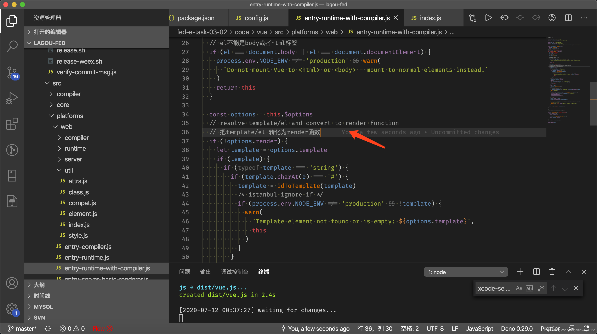
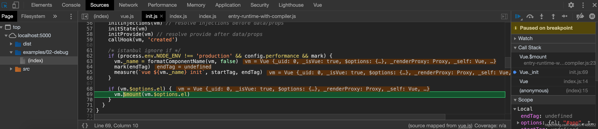
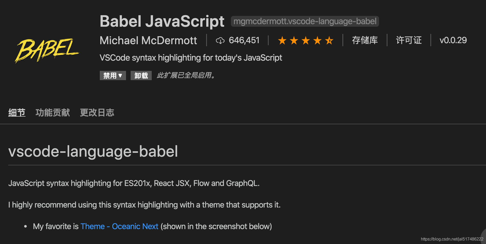
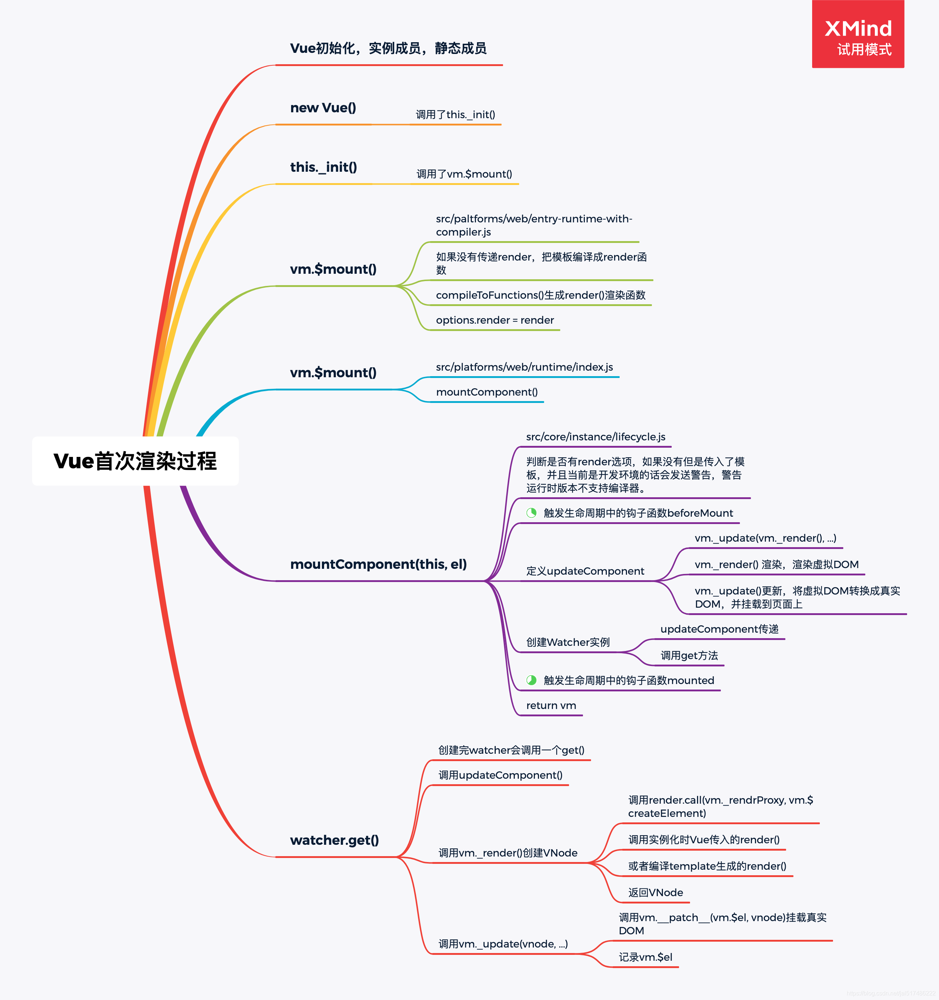

# Vue.js源码剖析-响应式原理

## 一、准备工作

### 1. Vue源码的获取

- 项目地址：https://github.com/vuejs/vue

- Fork一份到自己仓库，克隆到本地，可以自己写注释提交到GitHub

- 为什么分析Vue2.6
    - 到目前为止Vue3.0的正式版还没有发布

    - 新版本发布后，现有项目不会升级到3.0，2.x还有很长的一段过渡期

    - 3.0项目地址：http://github.com/vuejs/vue-next

### 2. 源码目录结构
    src

    |——compiler 编译相关

    |——core Vue核心库

    |——platforms 平台相关代码

    |——server SSR、服务器端渲染

    |——sfc .vue 文件编译为js对象

    |——shared 公共的diamante

### 3. 了解Flow
- 官网：https://flow.org/

- JavaScript的静态类型检查器

- Flow的静态类型检查错误是通过静态类型推断实现的

    - 文件开头通过 // @flow 或者 /* @flow */声明

```js
/* @flow */
function square(n: number): number {
  return n * n
}
square("2") // Error!
```

### 4. 调试设置

#### (1). 打包

- 打包工具Rollup

    - Vue.js源码的打包工具使用时Rollup，比Webpack轻量
    - Webpack把所有文件当做模块，Rollup只处理js文件，更适合在Vue.js这样的库中使用
    - Rollup打包不会生成冗余的代码

- 安装依赖

    - yarn

- 设置sourcemap

    - package.json文件中的dev脚本中添加参数 --sourcemap

        - `"dev": "rollup -w -c scripts/config.js --sourcemap --environment TARGET:web-full-dev"`

- 执行dev

    - yarn dev执行打包，用的是Rollup，-w参数是监听文件的变化，文件变化自动重新打包
    - 结果: 生成了dist目录

- 执行build

    - yarn build生成了不同版本的Vue

## 二、 Vue的不同构建版本

### 1. Vue的不同构建版本

- npm run build 重新打包所有文件

- 官方文档-对不同构建版本的解释

- dist/README.md

|| UMD | CommonJS | ES Module (基于构建工具使用) | ES Module (直接用于浏览器) | |
| :---------------------------- | :----------------- | :--------------------------- | :------------------------- | ---------------------- |
| **完整版** | vue.js | vue.common.js | vue.esm.js | vue.esm.browser.js |
| **只包含运行时版** | vue.runtime.js | vue.runtime.common.js | vue.runtime.esm.js | - |
| **完整版 (生产环境)** | vue.min.js | - | - | vue.esm.browser.min.js |
| **只包含运行时版 (生产环境)** | vue.runtime.min.js | - | - | - |

### 2. 术语

- **完整版**：同时包含编译器和运行时的版本。

- **编译器**：用来将模板字符串编译成为 JavaScript 渲染函数的代码，体积大，效率低。

- **运行时**：用来创建 Vue 实例、渲染并处理虚拟 DOM 等的代码。体积小，效率高，基本上就是除去编译器的其它一切。

- **UMD**：通用的模块版本，支持多种模块方式。UMD 版本可以通过 `<script>` 标签直接用在浏览器中。jsDelivr CDN 的 https://cdn.jsdelivr.net/npm/vue 默认文件就是运行时 + 编译器的 UMD 版本 (vue.js)。

- **CommonJS**：CommonJS 版本用来配合老的打包工具比如 Browserify 或 webpack 1。这些打包工具的默认文件 (pkg.main) 是只包含运行时的 CommonJS 版本 (vue.runtime.common.js)。

- **ES Module**：从 2.6 开始 Vue 会提供两个 ES Modules (ESM) 构建文件：

    - 为打包工具提供的 ESM：为诸如 webpack 2 或 Rollup 提供的现代打包工具。ESM 格式被设计为可以被静态分析，所以打包工具可以利用这一点来进行“tree-shaking”并将用不到的代码排除出最终的包。为这些打包工具提供的默认文件 (pkg.module) 是只有运行时的 ES Module 构建 (vue.runtime.esm.js)。

    - 为浏览器提供的 ESM (2.6+)：用于在现代浏览器中通过 `<script type="module">` 直接导入。

```js
// vue脚手架创建的Vue项目中，引用的Vue版本就是运行时版本：vue.runtime.esm.js

// 我们可以在Vue项目中执行：vue inspect > output.js，将webpack配置输出到output.js文件中查看，

resolve: {
    alias: {
      '@': '/Users/mac/JALProjects/lagou-fed/fed-e-task-03-02/code/01-demo/src',
      vue$: 'vue/dist/vue.runtime.esm.js'
    },
}
```

## 三、 寻找入口文件

查看dist/vue.js的构建过程

执行构建： yarn dev

## 四、 从入口开始

src/platform/web/entry-runtime-with-compiler.js

通过查看源码解决下面问题：

### 1. 问：观察一下代码，通过阅读源码，回答在页面上输出的结果

```js
const vm = new Vue({
  el: '#app',
  template: '<h1>Hello template </h1>',
  render (h) {
    return h('h4', 'Hello render')
  }
})
```

答：是优先使用render



### 2. 问：$mount是在什么时候调用的？

答：是在init方法中调用的，可以在$mount函数定义的地方打断点，然后看调用栈的函数



### 3. 学习源码记录

- el不能是body或者是html标签

- 如果没有render，把template转换成render函数

- 如果有render方法，直接调用mount挂载DOM

### 4. 调试代码

- 调试的方法

    - 查看浏览器开发人员工具里Sources的CallStack调用堆栈

        - Vue的构造函数在哪个？

        - Vue实例的成员/Vue的静态成员从哪里来的？

## 五、Vue的初始化过程

### 1. 四个导出Vue的模块

**(1). src/platforms/web/entry-runtime-with-compilerjs**

- web平台相关的入口

- 重写了平台相关的

- $mount()方法

- 注册了Vue.compile()方法，传递一个HTML字符串返回render函数

**(2). src/platforms/web/runtime/index.js**

- web平台相关

- 注册和平台相关的全局指令: v-model、 v-show

- 注册和平台相关的全局组件: v- transition,v-transition-group

- 全局方法:

    - _patch_: 把虚拟DOM转换成真实DOM

    - $mount:挂载方法

**(3). src/core/index.js**

与平台无关

设置了Vue的静态方法，initGlobalAPl(Vue)

**(4). src/core/instance/index.js**

- 与平台无关

- 定义了构造函数，调用了this.init(options) 方法

- 给Vue中混入了常用的实例成员

### 2. 看源码中的两个问题

**(1) 关闭JS语法检查爆红问题**

在vscode的settings.json里，将"javascript.validate.enable"设为false

**(2) flow中的泛型影响代码的高亮显示**

在vscode插件商城里安装Babel JavaScript这个插件，可以让泛型后面的代码可以高亮显示，但失去了跳转链接的作用



### 3. 静态方法

./src/core/global-api/index.js

  ```js
  // 设置keep-alive组件
  extend(Vue.options.components, builtInComponents)

  // 注册Vue.use()用来注册组件
  initUse(Vue)

  // 注册Vue.mixin()实现混入
  initMixin(Vue)

  // 注册Vue.extend()基础传入的options返回一个组件的构造函数
  initExtend(Vue)

  // 注册Vue.directive()、Vue.component()、Vue.filter()
  initAssetRegisters(Vue)
  ```

### 4. 实例成员
./src/core/instance/index.js

```js
// 注册vm的_init()方法，初始化vm
initMixin(Vue)

// 注册vm的$data/$props/$set/$delete/$watch
stateMixin(Vue)

// 初始化事件相关方法
// $on/$once/$off/$emit
eventsMixin(Vue)

// 初始化生命周期相关的混入方法
// _update/$forceUpdate/$destroy
lifecycleMixin(Vue)

// 混入render
// $nextTick/_render
renderMixin(Vue)
```

### 5. 构造函数

构造函数中调用了init方法。

./src/core/instance/init.js

```js
// vm的生命周期相关变量初始化
// $children/$parent/$root/$refs
initLifecycle(vm)

// vm的事件监听初始化，父组件绑定在当前组件上的事件
initEvents(vm)

// vm的编译render初始化
// $slots/$scopedSlots/_c/$createElement/$attrs/$listeners
initRender(vm)

// beforeCreate 生命钩子回调
callHook(vm, 'beforeCreate')

// 把inject的成员注入到vm上
initInjections(vm) // resolve injections before data/props

// 初始化vm的_props/methods/_data/computed/watch
initState(vm)

// 初始化provide
initProvide(vm) // resolve provide after data/props

// created 生命钩子的回调
callHook(vm, 'created')
```

### 6. 首次渲染过程

首先进行Vue的初始化，也就是初始化Vue的实例成员以及静态成员。

当初始化结束之后，开始调用构造函数，在构造函数中调用this._init()，这个方法相当于我们整个Vue的入口。

在_init()中最终调用了this.$mount()，共有两个$mount()，第一个$mount()是entry-runtime-with-compiler.js入口文件的$mount()，这个$mount()的核心作用是帮我们把模板编译成render函数，但它首先会判断一下我们当前是否传入了render选项，如果没有传入的话，它会去获取我们的template选项，如果template选项也没有的话，他会把el中的内容作为我们的模板，然后把模板编译成render函数，它是通过compileToFunctions()函数，帮我们把模板编译成render函数的,当把render函数编译好之后，它会把render函数存在我们的options.render中。

那接下来会调用runtime/index.js中的$mount()方法，这个方法中,首先会重新获取我们的el，因为如果是运行时版本的话，是不会entry-runtime-with-compiler.js这个入口中获取el，所以如果是运行时版本的话，我们会在runtime/index.js的$mount()中重新获取el。

接下来调用mountComponent(),mountComponent()是在src/core/instance/lifecycle.js中定义的，在mountComponent()中，首先会判断render选项，如果没有但是传入了模板，并且当前是开发环境的话会发送警告，警告运行时版本不支持编译器。

接下来会触发beforeMount这个生命周期中的钩子函数，也就是开始挂载之前。

然后定义了updateComponent()，在这个方法中，定义了_render和_update，_render的作用是生成虚拟DOM，_update的作用是将虚拟DOM转换成真实DOM，并且挂载到页面上来。

再接下来就是创建Watcher对象，在创建Watcher时，传递了updateComponent这个函数，这个函数最终是在Watcher内部调用的。在Watcher创建完之后还调用了get方法，在get方法中，会调用updateComponent()。

然后触发了生命周期的钩子函数mounted,挂载结束，最终返回Vue实例。



### 7. 响应式处理过程

- initState() --> initData() --> observe()

- observe(value)

    - 位置：src/core/observer/index.js

    - 功能：

        - 判断value是否是对象，如果不是对象直接返回

        - 判断value对象是否有__ob__,如果有直接返回

        - 如果没有，创建observer对象

        - 返回observer对象

- Observer

    - 位置：src/core/observer/index.js
    - 功能：
        - 给value对象定义不可枚举的__ob__属性，记录当前的observer对象
        
        - 数组的响应式处理
        
        - 对象的响应式处理，调用walk方法
    
- defineReactIve

    - 位置：src/core/observer/index.js

    - 功能：
        
        - 为每一个属性创建dep对象
        
        - 如果当前属性的值是对象，调用observe
        
        - 定义getter
        
            - 收集依赖
            
            - 返回属性的值
        
        - 定义setter
        
            - 保存新值
            
            - 如果新值是对象，调用observe
            
            - 派发更新（发送通知），调用dep.notify()

- 收集依赖

    - 在watcher对象的get方法中调用pushTarget记录Dep.target属性
    
    - 访问data中的成员的时候收集依赖，defineReactive的getter中收集依赖
    
    - 把属性对应的watcher对象添加到dep的subs数组中
    
    - 给childOb收集依赖，目的是子对象添加和删除成员时发送通知

- Watcher

- dep.notify()在调用watcher对象的update()方法

- queueWatcher()判断watcher是否被处理，如果没有的话添加到queue队列中，并调用flushScheduleQueue()

- flushScheduleQueue()
    
    - 触发beforeUpdate钩子函数
    
    - 调用watcher.run()： run() --> get() --> getter() --> updateComponent
    
    - 清空上一次的依赖
    
    - 触发actived的钩子函数
    
    - 触发updated钩子函数

### 8. Vue给响应式对象添加一个响应式属性–set方法

- Vue.set()定义位置：global-api/index.js

```js
// 静态方法：set/delete/nextTick
  Vue.set = set
  Vue.delete = del
  Vue.nextTick = nextTick
```

- vm.$set()定义位置：instance/index.js


```js
// 注册vm的$data/$props/$set/$delete/$watch
stateMixin(Vue)

// instance/state.js
Vue.prototype.$set = set
```

使用：`Vue.set(target, attrName, attrValue)`或`vm.$set(target, attrName, attrValue)`

例如：`Vue.set(vm.obj, 'name', 'zhangsan')`

源码中set方法的实现(**关键点：调用了ob.dep.notify()**)：

```js
/**
 * Set a property on an object. Adds the new property and
 * triggers change notification if the property doesn't
 * already exist.
 */
export function set (target: Array<any> | Object, key: any, val: any): any {
  if (process.env.NODE_ENV !== 'production' &&
    (isUndef(target) || isPrimitive(target))
  ) {
    warn(`Cannot set reactive property on undefined, null, or primitive value: ${(target: any)}`)
  }
  if (Array.isArray(target) && isValidArrayIndex(key)) {
    target.length = Math.max(target.length, key)
    target.splice(key, 1, val)
    return val
  }
  if (key in target && !(key in Object.prototype)) {
    target[key] = val
    return val
  }
  const ob = (target: any).__ob__
  if (target._isVue || (ob && ob.vmCount)) {
    process.env.NODE_ENV !== 'production' && warn(
      'Avoid adding reactive properties to a Vue instance or its root $data ' +
      'at runtime - declare it upfront in the data option.'
    )
    return val
  }
  if (!ob) {
    target[key] = val
    return val
  }
  defineReactive(ob.value, key, val)
  ob.dep.notify()
  return val
}
```

### 9. 删除一个响应式属性–delete方法

Vue.delete()或vm.$delete()删除对象的属性。如果对象时响应式的，确保删除能触发更新视图。这个方法主要用于避免Vue不能检测到属性被删除的限制。（其实开发者应该会很少使用到它）

 - 注意：目标对象不能是一个Vue实例或Vue实例的根数据对象。

示例：vm.$delete(vm.obj, 'msg') 或Vue.delete(vm.obj, 'msg')

定义位置：同上的set。

源码中delete方法的实现(**关键点：调用了ob.dep.notify()**)：

```js
/**
 * Delete a property and trigger change if necessary.
 */
export function del (target: Array<any> | Object, key: any) {
  if (process.env.NODE_ENV !== 'production' &&
    (isUndef(target) || isPrimitive(target))
  ) {
    warn(`Cannot delete reactive property on undefined, null, or primitive value: ${(target: any)}`)
  }
  if (Array.isArray(target) && isValidArrayIndex(key)) {
    target.splice(key, 1)
    return
  }
  const ob = (target: any).__ob__
  if (target._isVue || (ob && ob.vmCount)) {
    process.env.NODE_ENV !== 'production' && warn(
      'Avoid deleting properties on a Vue instance or its root $data ' +
      '- just set it to null.'
    )
    return
  }
  if (!hasOwn(target, key)) {
    return
  }
  delete target[key]
  if (!ob) {
    return
  }
  ob.dep.notify()
}
```

### 10. 异步更新队列，$nextTick

- Vue更新DOM是异步执行的，批量的

    - 在下次DOM更新循环结束之后执行延迟回调。在修改数据之后立即使用这个方法，获取更新后的DOM。

- vm.$nextTick(function () {/*操作DOM*/}) / Vue.nextTick(function () {})

源码中nextTick方法的实现(关键点：调用timerFunc())：

```js
export function nextTick (cb?: Function, ctx?: Object) {
  let _resolve
  callbacks.push(() => {
    if (cb) {
      try {
        cb.call(ctx)
      } catch (e) {
        handleError(e, ctx, 'nextTick')
      }
    } else if (_resolve) {
      _resolve(ctx)
    }
  })
  if (!pending) {
    pending = true
    timerFunc()
  }
  // $flow-disable-line
  if (!cb && typeof Promise !== 'undefined') {
    return new Promise(resolve => {
      _resolve = resolve
    })
  }
}
```

mounted中的更新数据是一个异步的过程，可以通过nextTick获取最新值，在nextTick的回调函数中，视图已经更新完毕，所以可以获取视图上的最新数据。

用户传入的回调函数会存到callbacks数组中，然后在timerFunc函数中以微任务的形式执行callbacks。微任务是在本次任务完成之后，才会去执行。nextTick是获取DOM上的最新数据，当微任务执行的时候，DOM元素还未渲染到浏览器上，但其实在nextTick中的回调函数执行之前，数据已经被改变了，当数据改变的时候，会通知watcher渲染视图，但在watcher里是先更新DOM树，而什么时候将DOM数据更新到浏览器上，是这次事件循环结束之后，才会执行DOM的渲染。nextTick中获取DOM数据是从DOM树上获取数据的，此时DOM还未渲染到浏览器中。nextTick中优先使用Promise执行微任务。在非IE浏览器中，使用了MutationObserver执行微任务。如果Promise和MutationObserver都不支持，则使用setImmediate，setImmediate只有IE浏览器和Nodejs支持。有的浏览器不支持微任务，则降级使用setTimeout

`注：setImmediate的性能比setTimeout好，在定时时间为0的时候，setTimeout会延迟4ms才会执行，而setImmediate会立即执行。`
