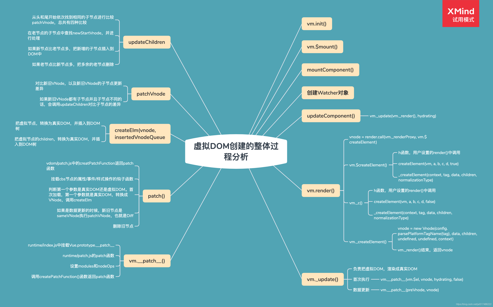

# Vue源码–虚拟DOM

## 一、虚拟DOM回顾

### 1. 什么是虚拟DOM

- 虚拟DOM就是使用JavaScript对象描述真实DOM

- Vue中的虚拟DOM借鉴Snabbdom，并添加了Vue的特性，例如指令和组件机制

### 2. 为什么要使用虚拟DOM

- 避免直接操作DOM，提高开发效率

- 作为一个中间层可以跨平台

- 虚拟DOM不一定可以提高性能

    - 首次渲染的时候会增加开销

    - 复杂视图情况下提升渲染性能

### 3. h函数

- vm.$createElement(tag, data, children, normalizeChildren)

    - tag：标签名称或者组件对象

    - data：描述tag，可以设置DOM的属性或者标签的属性

    - children：tag中的文本内容或者子节点

### 4. h函数的返回结果–VNode

- VNode的核心属性

    - tag

    - data

    - children

    - text

    - elm

    - key

## 二、虚拟DOM整体分析

