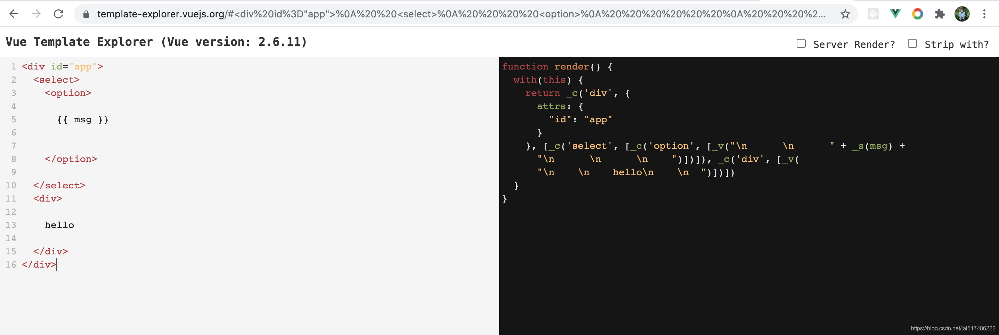
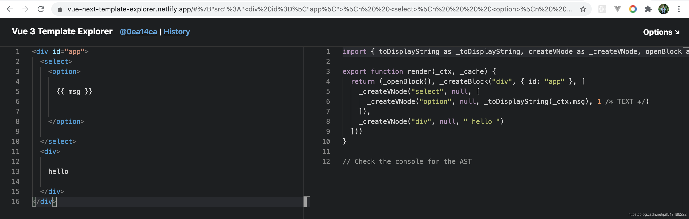
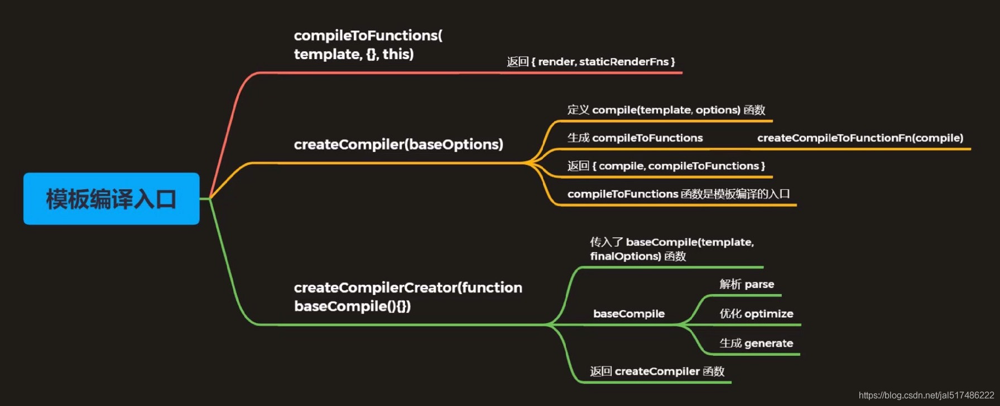
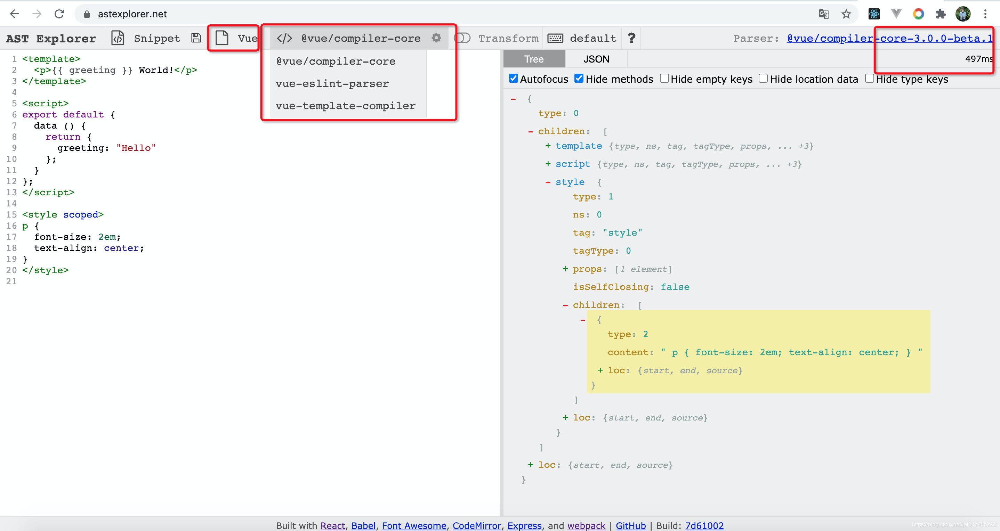
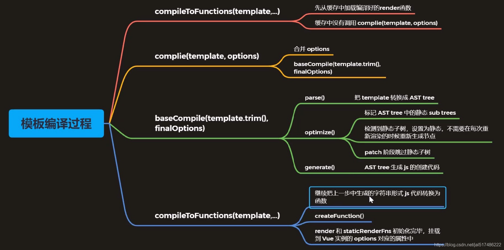

# Vue模板编译

## 一、模板编译介绍

### 1. 模板编译简介

模板编译的主要目的是将模板（template）转换为渲染函数（render）

```js
<div>
  <h1 @click="handler">
    title
  </h1>
  <p>
		some content    
  </p>
</div>
```

渲染函数:

```js
render (h) {
  return h('div', [
    h('h1', { on: { click: this.handler } }, 'title'),
    h('p', 'some content')
  ])
}
```

### 2. 模板编译的作用

- Vue2.0使用VNode描述视图以及各种交互，用户自己编写VNode比较复杂

- 用户只需要编写类似HTML的代码 - Vue.js模板，通过编译器将模板转换为返回VNode的render函数

- .vue文件会被webpack在构建的过程中转换成render函数

## 二、体验模板编译的结果

### 1. 编译生成的函数的位置

- `_c()`

    - `src/core/instance/render.js`

- `_m()/_v()/_s()`

    - `src/core/instance/render-helpers/index.js`

### 2. 模板编译的结果

```js
(function anonymous() {
  with (this) {
    return _c(
    	"div",
      { attrs: { id: "app" } },
      [
        _m(0), // 静态标签
        _v(" "), // 节点之间的空白字符
        _c("p", [_v(_s(msg))]), // _s是转换成字符串
        _v(" "),
        _c("comp", { on: {myclick: handler } }), // 自定义模板
      ],
      1 // 1表示如果是二维数组，会进行拍平
    )
  }
})
```


### 3. Vue Template Explorer

这是一个网页工具，是将HTML模板转换为render函数，

Vue2网址是：https://template-explorer.vuejs.org/



Vu3网址是：https://vue-next-template-explorer.netlify.app/



我们可以看到Vue对render函数做了优化，此外Vue2中的模板中尽量不要出现多余的空白，因为都会被转换到render函数中，Vue3的模板中的空白则不影响render函数

## 三、模板编译的入口



## 四、模板编译的过程

### 1. 模板编译入口

位置：src/compiler/create-compiler.js

createCompilerCreator函数返回了compile对象和compileToFunctions函数。

模板编译的入口函数 compileToFunctions() 中的 generate 函数的作用是把优化后的 AST 转换成代码

模板和插值表达式在编译的过程中都会被转换成对应的代码形式，不会出现在 render 函数中

### 2. 模板编译过程 - baseCompile - AST

位置：src/compiler/index.js

在createCompilerCreator函数中，首先用parse函数把模板转换成ast抽象语法树，然后使用optimize函数优化抽象语法树，再用generate函数把抽象语法书生成字符串形式的js代码

```js
export const createCompiler = createCompilerCreator(function baseCompile (
  template: string,
  options: CompilerOptions
): CompiledResult {
  // 把模板转换成ast抽象语法树
  // 抽象语法树，用来以树形的方式描述代码结构
  const ast = parse(template.trim(), options)
  if (options.optimize !== false) {
    // 优化抽象语法树
    optimize(ast, options)
  }
  // 把抽象语法书生成字符串形式的js代码
  const code = generate(ast, options)
  return {
    ast,
    // 渲染函数
    render: code.render,
    // 静态渲染函数
    staticRenderFns: code.staticRenderFns
  }
})
```

### 3. 为什么要使用抽象语法树

- 模板字符串转换成AST后，可以通过AST对模板做优化处理

- 标记模板中的静态内容，在patch的时候直接掉过静态内容

- 在patch的过程中静态内容不需要对比和重新渲染

### 4. AST在线生成网站

AST 在线生成网址：https://astexplorer.net/



### 5. 模板编译过程 - baseCompile - optimize

位置：src/compiler/optimizer.js

优化处理，跳过静态子树。staticRoot是静态根节点。指节点中只包含纯文本的节点，是静态节点，但不是静态根节点，因为此时优化的成本大于收益，Vue认为这种优化会带来负面的影响

静态根节点不会被重新渲染，patch 的过程中会跳过静态根节点。

### 6. 模板编译过程 - baseCompile - generate

generate() 函数返回的是字符串形式的代码，还需要 toFunctions() 转换成函数的形式

### 7. 模板编译过程 - 总结



## 五、组件化回顾

- 一个Vue组件就是一个用于预定义选项的一个Vue实例

- 一个组件可以组成页面上的一个功能完备的区域，组件可以包含脚本、样式、模板

## 六、组件注册

### 1. 组件注册方式

- 全局组件

- 局部组件

### 2. Vue.extend

根据传入的选项创建组件的构造函数，组件的构造函数继承自Vue的构造函数。

## 七、组件的创建过程

### 1. 回顾首次渲染过程

- Vue构造函数

- this._init()

- this.$mount()

- mountComponent()

- new Watcher() 渲染Watcher

- updateComponent()

- vm.render() -> createElement()

- vm._update()

### 2. 组件的patch过程

先创建父组件，再创建子组件。

先挂载子组件，再挂载父组件。

在 createElement() 函数中调用 createComponent() 创建的是组件的 VNode。组件对象是在组件的 init 钩子函数中创建的，然后在 patch() --> createElm() --> createComponent() 中挂载组件

全局组件之所以可以在任意组件中使用是因为 Vue 构造函数的选项被合并到了 VueComponent 组件构造函数的选项中。

局部组件的使用范围被限制在当前组件内是因为，在创建当前组件的过程中传入的局部组件选项，其它位置无法访问


